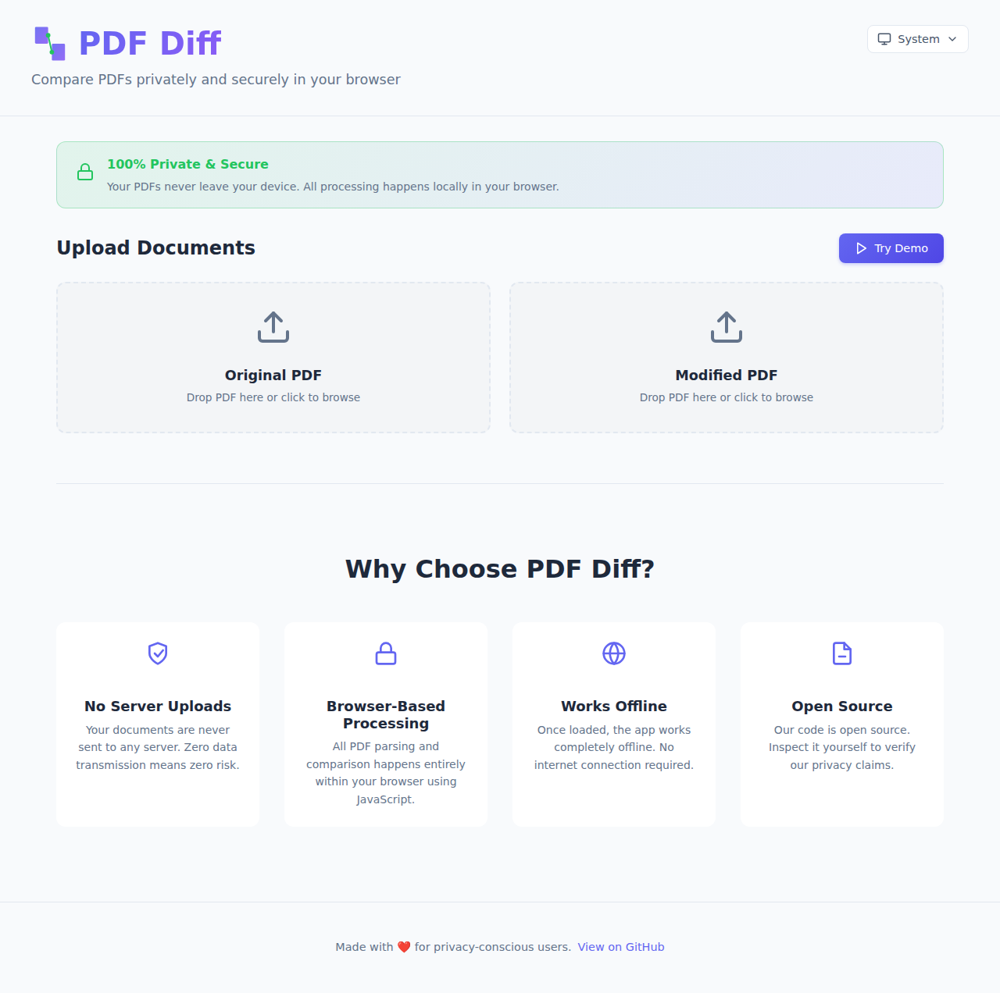
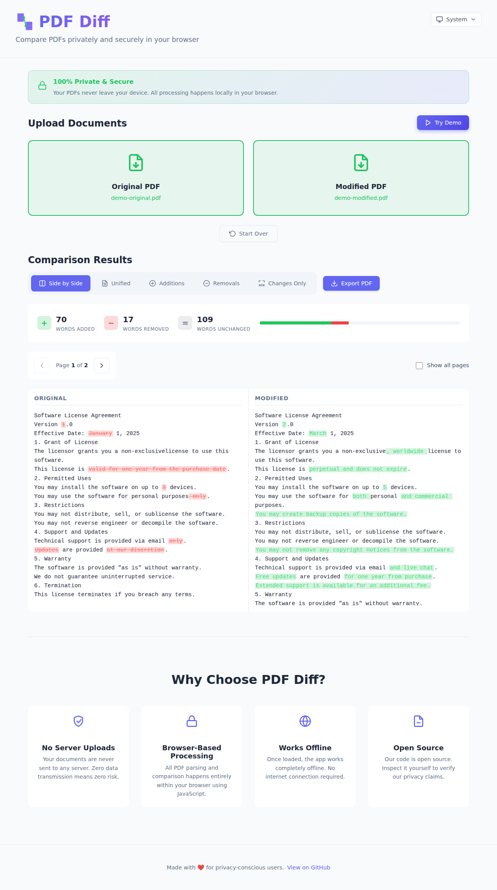
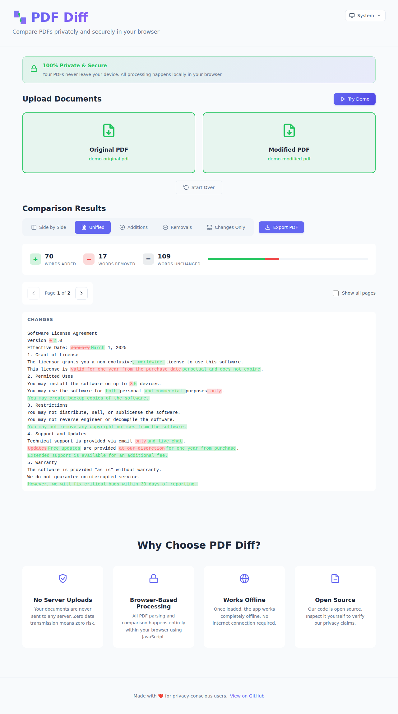
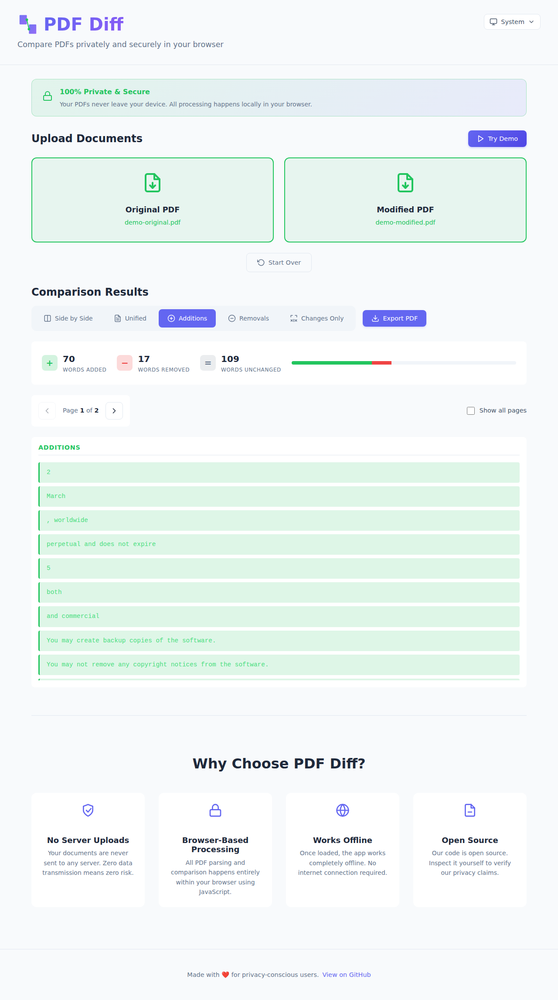
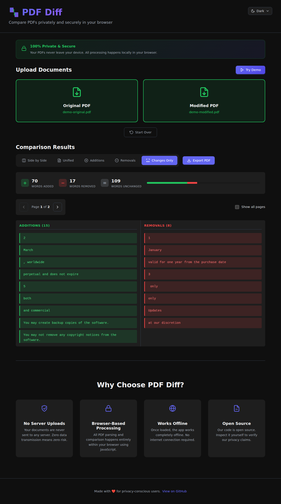
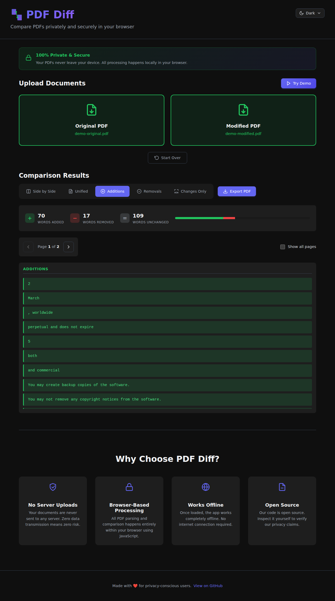

# Introducing PDF Diff: Compare PDFs Privately in Your Browser

Hey friends! I'm super excited to share a new tool I've been working on that solves a problem I bet many of you have faced: **how do you quickly compare two PDF documents to see what changed?**

## Why I Built This

Look, we've all been there. You get two versions of a contract, a proposal, or a license agreement, and you need to figure out what changed between them. Sure, you could upload them to some random website, but do you really want to send your potentially sensitive documents to a server somewhere? I know I don't.

So I built [PDF Diff](https://www.pdf-diff.com) - a completely **client-side, privacy-first PDF comparison tool** that runs entirely in your browser. No servers. No uploads. No risk.

## Privacy First, Always

This is the core principle that drove the entire development: **your documents never leave your device**. Period.

Everything happens locally in your browser using JavaScript. All the PDF parsing, text extraction, and comparison logic runs on your machine. Once you load the page, you can even disconnect from the internet and keep using it. That's the power of modern web technology, and it's beautiful.

## What Can You Do With It?

I packed in a bunch of features to make comparing PDFs as easy and flexible as possible:

### Multiple View Modes

Different people need to see changes in different ways, so I built five different view modes:

**Side-by-Side View** - This is the classic comparison view. Original on the left, modified on the right, with synchronized scrolling. Perfect for getting the full context of both documents.

**Unified View** - All changes shown inline with color coding. Green for additions, red for deletions. This is great when you want to see everything in one continuous flow.

**Additions Only** - Just show me what's new! This view filters out everything except the added content. Super useful when you're reviewing what someone added to a document.

**Removals Only** - The opposite - show only what was deleted. Great for catching what might have been taken out of a contract or agreement.

**Changes Only** - This one's clever - it shows additions and removals side-by-side, grouped by where they appear in the document. You get a focused view of just the changes without any of the unchanged content.

### Real-Time Statistics

As soon as you upload your PDFs, you get instant statistics:
- How many words were added
- How many were removed  
- How many stayed the same
- Overall change percentage

This gives you a quick sense of how significant the changes are before diving into the details.

### Multi-Page Support

Documents aren't always single pages! PDF Diff handles multi-page documents with easy page navigation. You can step through page-by-page, or flip on "Show all pages" to see changes across the entire document at once.

### Export to PDF

Found something important? Export your comparison as a formatted PDF report that you can save or share. The export includes your selected view mode, so you can generate exactly the report you need.

### Dark Mode

Because of course it has dark mode. Your eyes will thank you. 🌙

### Try the Demo

Not ready to upload your own PDFs yet? Hit the "Try Demo" button to see it in action with sample license agreement documents. It's the fastest way to understand how powerful this tool is.

## The Technical Bits

For my fellow developers out there, here's what's under the hood:

### Modern Stack

I built this with some of my favorite modern web technologies:

- **React 19** - The latest and greatest from the React team. The new concurrent rendering features make the UI incredibly smooth even when processing large documents.
- **TypeScript** - Type safety is non-negotiable for me these days. It catches so many bugs before they make it to production.
- **Vite** - Lightning-fast build tool that makes development a joy. Hot module replacement is so fast you barely notice it refreshing.
- **PDF.js** - Mozilla's incredible PDF rendering engine. This is what powers the PDF parsing and text extraction, and it's rock solid.
- **jsPDF** - For generating the export PDFs. Great library, easy to use.
- **diff** - The text comparison algorithm at the heart of the whole thing. This library does the heavy lifting of computing what changed.

### Architecture Decisions

The entire app is client-side only. No backend, no API, no database. Just static files served from a CDN. This architecture choice has some huge benefits:

1. **Privacy by design** - Can't leak data to a server if there is no server
2. **Scales infinitely** - Static files are cheap and can handle unlimited traffic
3. **Works offline** - Progressive Web App capabilities mean it works without internet
4. **Fast** - No network round trips for processing
5. **Simple** - No servers to maintain or databases to manage

The comparison logic is surprisingly straightforward - extract text from both PDFs, run a diff algorithm, and render the results. But getting the details right (handling multi-page docs, preserving formatting, making the UI responsive) is where the real work happens.

## Built with Modern Tools

I have to give a huge shoutout to the tools that made building this such a smooth experience:

### VS Code + GitHub Copilot

I've been using VS Code for years, and GitHub Copilot has become an indispensable part of my workflow. Writing the TypeScript interfaces, React components, and utility functions was so much faster with Copilot suggesting completions and entire functions.

The autocomplete for repetitive patterns (like all those view mode switches) saved me tons of time. And when I was implementing the different view modes, Copilot would often suggest exactly the logic I was thinking about. It's like pair programming with an AI that never gets tired.

### GitHub Copilot Workspace

Here's where things get really cool. I used the new **GitHub Copilot Cloud agent** to help with some of the more complex parts of the build. The agent can understand your entire codebase context and help you make architectural decisions, write tests, and even suggest optimizations.

For example, when I was working on the export functionality, I described what I wanted (a formatted PDF with the comparison results), and the agent helped me figure out the best way to structure the jsPDF calls and format the output. It understood the context of my existing code and suggested changes that fit perfectly with my patterns.

The Cloud agent also helped me optimize the PDF parsing logic for performance. When I noticed larger documents were taking a while to process, I described the problem, and it suggested some clever optimization strategies like memoizing the text extraction and using Web Workers for heavy computation (I ended up not needing Web Workers, but it was a smart suggestion).

### Open Source

The entire project is open source on [GitHub](https://github.com/jamesmontemagno/pdf-diff). I'm a huge believer in open source, and I wanted anyone to be able to:
- Verify that the privacy claims are true (inspect the code yourself!)
- Contribute improvements or bug fixes
- Learn from the code
- Fork it for their own needs

## Try It Out!

Ready to compare some PDFs? Head over to [www.pdf-diff.com](https://www.pdf-diff.com) and give it a try. Start with the demo if you want to see it in action, or upload your own documents if you're ready to go.

I'd love to hear your feedback! Found a bug? Have a feature request? Want to contribute? [Open an issue](https://github.com/jamesmontemagno/pdf-diff/issues) or submit a PR. 

And if you find this useful, give it a ⭐️ on GitHub - it really helps others discover the tool.

## What's Next?

I've got a few ideas for future improvements:
- Support for comparing more than two documents
- Highlighting specific types of changes (numbers, dates, etc.)
- Better handling of PDFs with images and complex layouts
- Integration with cloud storage providers (while maintaining privacy)
- Browser extensions for quick access

But I want to hear from you - what would make PDF Diff more useful for your workflow?

## Wrapping Up

Building PDF Diff has been a fun journey, and I'm proud of how it turned out. It solves a real problem I had, and I hope it helps you too. The combination of modern web technologies, privacy-first design, and powerful developer tools made it possible to build something genuinely useful in a relatively short time.

The web platform has come so far. The fact that we can parse PDFs, compute diffs, and render beautiful UIs entirely in the browser - without any server-side code - is pretty amazing. And tools like GitHub Copilot and the Cloud agent make the development experience better than ever.

Give it a try and let me know what you think!

Cheers,  
James

---

*P.S. - If you're interested in building your own privacy-first web tools, the source code is a great reference. Everything you need to get started is in the [README](https://github.com/jamesmontemagno/pdf-diff#readme).*
